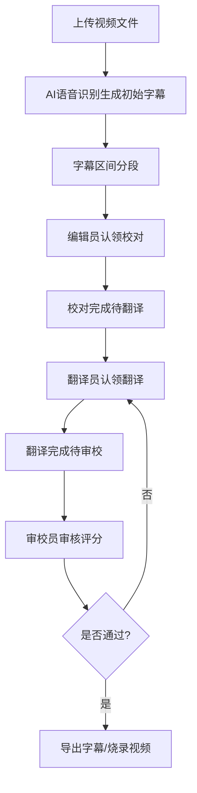
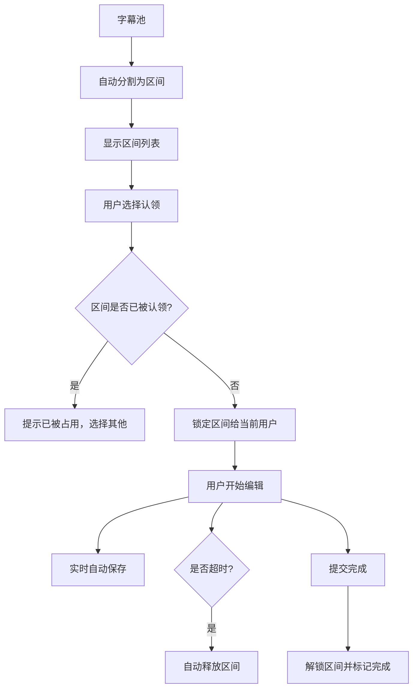

## 1. 产品概述

视频字幕制作与翻译协作平台，专注于视频内容的字幕生产与多语言本地化。通过AI语音识别自动生成初始字幕，结合众包协作模式实现高效的字幕校对、翻译与审校流程，最终产出高质量多语言字幕文件。

- 解决视频字幕制作效率低、多人协作易冲突、翻译质量难把控的痛点
- 面向内容创作者、翻译团队、众包译者，提供专业级字幕生产工具链
- 目标是成为视频本地化领域的一站式协作平台，大幅降低字幕制作成本与周期

---

## 2. 核心功能

### 2.1 用户角色

| 角色 | 注册方式 | 核心权限 |
|------|----------|----------|
| 项目管理员 | 邮箱/手机号注册 | 创建项目、上传视频、分配任务、导出最终成果、管理团队成员 |
| 字幕编辑员 | 邮箱/手机号注册 | 认领字幕区间、调整时间轴、校对识别文字、提交校对结果 |
| 翻译人员 | 邮箱/手机号注册 | 认领翻译区间、填写译文、查看原文上下文、提交翻译结果 |
| 审校人员 | 邮箱/手机号注册 | 逐行审核原译文、标注修改意见、给出质量评分、确认通过/驳回 |
| 贡献者 | 邮箱/手机号注册 | 查看个人工作量统计、质量评分、报酬明细、历史贡献记录 |

### 2.2 功能模块

1. **项目列表页**：项目卡片展示、创建/编辑项目、项目状态追踪、多语言版本管理
2. **视频上传页**：视频拖拽上传、格式校验、上传进度显示、AI语音识别触发
3. **字幕编辑器**：视频播放同步、时间轴可视化调整、逐行文字编辑、分段认领、多人协作状态
4. **翻译工作台**：双语对照界面、原文锁定、译文输入、时间轴自动同步、翻译记忆提示
5. **审校工作台**：三栏对照视图（原文/译文/修改意见）、质量评分、逐行批注、通过/驳回操作
6. **导出中心**：字幕格式选择（SRT/ASS/VTT）、烧录字幕到视频、批量导出多语言版本
7. **贡献者中心**：个人数据仪表盘、处理行数统计、质量评分曲线、报酬计算明细、历史项目
8. **播放器预览**：多语言字幕轨道切换、字幕样式自定义、播放速度调整、全屏预览

### 2.3 页面详情

| 页面名称 | 模块名称 | 功能描述 |
|----------|----------|----------|
| 项目列表页 | 项目看板 | 卡片式展示项目进度、成员数量、语言版本、截止日期 |
| 项目列表页 | 快速操作 | 创建项目、搜索筛选、按状态/时间排序、批量操作 |
| 视频上传页 | 上传区域 | 拖拽上传、文件选择、格式（MP4/MOV/AVI）与大小校验 |
| 视频上传页 | 识别配置 | 选择源语言、AI模型、识别精度选项、预计完成时间 |
| 字幕编辑器 | 视频播放器 | 播放控制、进度跳转、帧级定位、快捷键支持 |
| 字幕编辑器 | 时间轴轨道 | 可视化字幕块、拖拽调整起止时间、边界吸附对齐 |
| 字幕编辑器 | 字幕列表 | 逐行显示时间码与文字、实时编辑、状态标记（未认领/进行中/已完成） |
| 字幕编辑器 | 协作面板 | 显示在线用户、认领区间冲突检测、实时保存提示 |
| 翻译工作台 | 双语对照区 | 左侧原文锁定只读、右侧译文输入框、上下句上下文预览 |
| 翻译工作台 | 工具区 | 翻译术语库、常用短语快捷插入、字数统计、进度显示 |
| 审校工作台 | 三栏视图 | 原文、译文、修改意见三列并列、差异高亮显示 |
| 审校工作台 | 评分系统 | 准确度评分、流畅度评分、格式规范评分、综合得分 |
| 导出中心 | 格式选择 | SRT/ASS/VTT格式切换、编码选择、样式预览 |
| 导出中心 | 视频烧录 | 选择字幕轨道、字体样式、位置、输出分辨率、编码格式 |
| 贡献者中心 | 数据仪表盘 | 处理行数、日均效率、质量评分趋势图、报酬累计 |
| 贡献者中心 | 任务历史 | 参与项目列表、各项目贡献明细、获得评价记录 |
| 预览播放器 | 多语言切换 | 语言轨道下拉选择、实时切换无卡顿、无字幕选项 |
| 预览播放器 | 字幕样式 | 字体大小、颜色、背景透明度、位置调整 |

---

## 3. 核心流程

### 3.1 字幕生产主流程

项目管理员上传视频，系统自动进行AI语音识别生成初始字幕。字幕编辑员认领字幕区间进行时间轴调整和文字校对，翻译人员认领翻译区间进行双语翻译，审校人员逐行审核并给出质量评分，最终导出字幕文件或烧录视频。

### 3.2 多人协作流程

系统将字幕自动分割为多个不重叠区间，编辑员/翻译员可自由认领未被认领的区间。同一区间同一时间仅允许一人编辑，避免冲突。认领后限时完成，超时自动释放。

---

## 4. 用户界面设计

### 4.1 设计风格

- **主色调**：深海蓝 `#0F3460` 作为主色，传达专业可靠的品牌调性
- **辅助色**：电光青 `#16C79A` 用于交互元素和状态提示，橙红 `#FF6B6B` 用于警告和错误状态
- **中性色**：深灰 `#1A1A2E` 作为背景，浅灰 `#E8E8E8` 作为边框和分隔线
- **整体风格**：专业极简主义，深色主题优先，强调内容可读性和操作效率
- **按钮风格**：扁平化设计，微圆角（4px），hover状态有微妙的光影变化
- **字体**：标题使用 `Chivo Mono` 等宽字体体现技术感，正文使用 `Noto Sans SC` 保证多语言可读性
- **布局风格**：模块化面板布局，可拖拽调整面板大小，高效利用屏幕空间
- **图标风格**：线性图标，统一2px描边，与整体极简风格保持一致

### 4.2 页面设计概述

| 页面名称 | 模块名称 | UI元素 |
|----------|----------|--------|
| 项目列表页 | 项目看板 | 卡片悬停上浮动效、进度条渐变填充、状态标签圆角胶囊 |
| 字幕编辑器 | 时间轴轨道 | 时间刻度标尺、字幕块可拖拽、选中块高亮发光效果 |
| 字幕编辑器 | 字幕列表 | 斑马纹背景、编辑行高亮、状态图标动态变化 |
| 翻译工作台 | 双语对照 | 左右分栏可拖动调整比例、译文输入框focus时边框发光 |
| 审校工作台 | 三栏视图 | 差异文字下划线标记、评分滑块带刻度、批注气泡 |
| 贡献者中心 | 数据仪表盘 | 面积图渐变色填充、数据卡片翻转动效、环形进度条 |
| 预览播放器 | 多语言切换 | 下拉菜单平滑展开、切换时字幕淡入淡出 |

### 4.3 响应式设计

- **桌面优先**：针对1920×1080及以上分辨率优化，多面板布局充分利用大屏空间
- **平板适配**：1024px断点，面板改为堆叠式布局，保留核心功能
- **手机适配**：768px断点，简化为单栏视图，重点功能（字幕编辑、翻译）保留，次要功能折叠
- **触摸优化**：所有可点击元素最小44×44px，滑动手势支持时间轴缩放和滚动

### 4.4 动效设计指南

- 页面加载：核心内容区域 staggered 渐入，延迟50ms依次显示
- 时间轴拖拽：字幕块跟随鼠标有轻微弹性效果，释放时有吸附动画
- 状态变更：完成标记时出现勾选动画，评分提交时有数字滚动效果
- 切换过渡：页面/模式切换使用300ms ease-out 淡入淡出
- 悬停反馈：可交互元素hover时有2px上浮和阴影加深
- 通知提示：右上角toast通知滑入滑出，成功/错误状态配色区分
