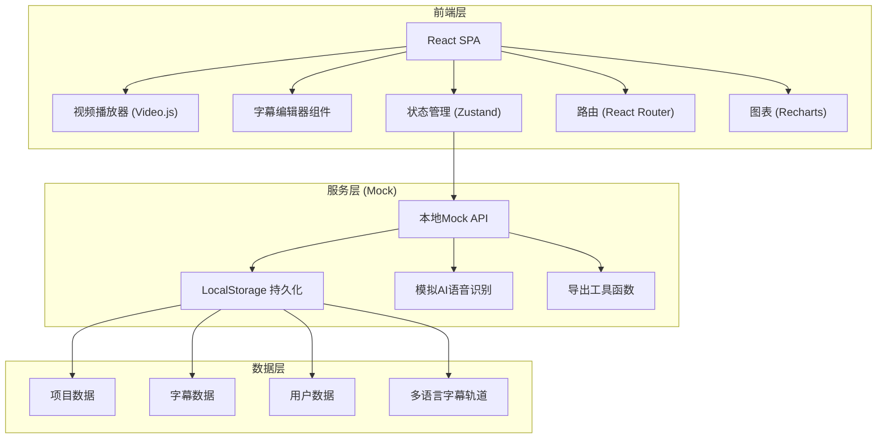
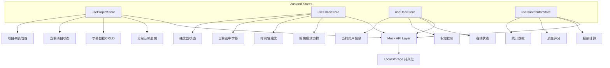
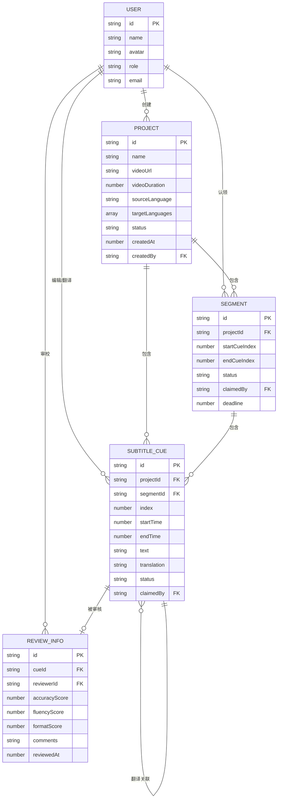

## 1. 架构设计



---

## 2. 技术描述

- **前端框架**: React@18 + TypeScript
- **构建工具**: Vite@5
- **样式方案**: TailwindCSS@3 + CSS Variables (主题系统)
- **状态管理**: Zustand (轻量级状态管理，支持分片存储)
- **路由方案**: React Router@6
- **视频播放**: Video.js@8 (稳定的HTML5视频播放器，支持多字幕轨道)
- **图表库**: Recharts@2 (贡献者数据可视化)
- **拖拽交互**: @dnd-kit/core + @dnd-kit/sortable (字幕块拖拽、区间调整)
- **图标库**: Lucide React (线性风格图标，与设计风格一致)
- **工具库**: date-fns (时间格式化)、uuid (唯一ID生成)
- **动画库**: Framer Motion (复杂动画效果)

**设计说明**:
- 采用纯前端架构，使用LocalStorage模拟后端数据持久化
- 所有API调用通过Mock层实现，便于后续接入真实后端
- 组件采用原子化设计，按功能模块组织目录
- 深色主题为默认主题，通过CSS变量支持主题切换

---

## 3. 路由定义

| 路由路径 | 页面名称 | 用途说明 |
|----------|----------|----------|
| `/` | 项目列表页 | 展示所有项目，创建新项目入口 |
| `/project/:id` | 项目详情页 | 项目概览、语言版本管理、成员管理 |
| `/project/:id/upload` | 视频上传页 | 视频上传与AI识别配置 |
| `/project/:id/editor` | 字幕编辑器 | 字幕校对、时间轴调整、分段认领 |
| `/project/:id/translate` | 翻译工作台 | 双语翻译、翻译记忆工具 |
| `/project/:id/review` | 审校工作台 | 质量审核、评分、批注 |
| `/project/:id/export` | 导出中心 | 字幕导出、视频烧录 |
| `/project/:id/preview` | 预览播放器 | 多语言字幕预览 |
| `/contributor` | 贡献者中心 | 个人数据统计、报酬明细 |

---

## 4. 类型定义

```typescript
// 基础类型
interface User {
  id: string;
  name: string;
  avatar: string;
  role: 'admin' | 'editor' | 'translator' | 'reviewer';
  email: string;
}

interface SubtitleCue {
  id: string;
  index: number;
  startTime: number; // 毫秒
  endTime: number;
  text: string;
  translation?: string;
  status: 'unclaimed' | 'editing' | 'edited' | 'translating' | 'translated' | 'reviewing' | 'approved' | 'rejected';
  claimedBy?: string;
  segmentId?: string;
  review?: ReviewInfo;
}

interface ReviewInfo {
  reviewerId: string;
  accuracyScore: number;
  fluencyScore: number;
  formatScore: number;
  comments: string;
  reviewedAt: number;
}

interface SubtitleSegment {
  id: string;
  startCueIndex: number;
  endCueIndex: number;
  status: 'unclaimed' | 'claimed' | 'completed';
  claimedBy?: string;
  deadline?: number;
}

interface Project {
  id: string;
  name: string;
  description: string;
  videoUrl: string;
  videoDuration: number;
  sourceLanguage: string;
  targetLanguages: string[];
  status: 'uploading' | 'processing' | 'editing' | 'translating' | 'reviewing' | 'completed';
  createdAt: number;
  createdBy: string;
  members: string[];
  subtitles: Record<string, SubtitleCue[]>; // 语言代码 -> 字幕数组
  segments: SubtitleSegment[];
}

interface ContributorStats {
  userId: string;
  totalLines: number;
  totalProjects: number;
  averageQualityScore: number;
  totalEarnings: number;
  monthlyStats: {
    month: string;
    lines: number;
    score: number;
  }[];
  recentProjects: {
    projectId: string;
    projectName: string;
    lines: number;
    role: string;
    score: number;
  }[];
}

interface ExportOptions {
  format: 'srt' | 'ass' | 'vtt';
  language: string;
  encoding: 'utf-8' | 'gbk';
  includeStyles?: boolean;
}

interface BurnOptions {
  language: string;
  fontFamily: string;
  fontSize: number;
  fontColor: string;
  backgroundColor: string;
  position: 'bottom' | 'top' | 'middle';
  resolution: '720p' | '1080p' | '4k';
}
```

---

## 5. 状态管理架构



---

## 6. 数据模型

### 6.1 ER图



### 6.2 Mock数据初始化

```typescript
// 初始化示例项目数据
const mockProjects: Project[] = [
  {
    id: 'proj-001',
    name: 'TED演讲：人工智能的未来',
    description: '2024年TED大会主题演讲，需要翻译成中英日韩四语字幕',
    videoUrl: '/sample-video.mp4',
    videoDuration: 1234000, // 约20分钟
    sourceLanguage: 'en',
    targetLanguages: ['zh-CN', 'ja', 'ko'],
    status: 'translating',
    createdAt: Date.now() - 86400000 * 3,
    createdBy: 'user-001',
    members: ['user-001', 'user-002', 'user-003', 'user-004'],
    subtitles: {
      'en': generateMockSubtitles(150, 'en'),
      'zh-CN': generateMockSubtitles(150, 'zh-CN'),
    },
    segments: generateMockSegments(150, 10),
  },
  // 更多项目...
];

// 生成模拟字幕数据
function generateMockSubtitles(count: number, lang: string): SubtitleCue[] {
  const samples = lang === 'en' ? enSamples : zhSamples;
  return Array.from({ length: count }, (_, i) => ({
    id: `cue-${i + 1}`,
    index: i + 1,
    startTime: i * 8000 + (Math.random() * 500),
    endTime: (i + 1) * 8000 - 100 + (Math.random() * 500),
    text: samples[i % samples.length],
    status: i < count * 0.3 ? 'approved' : i < count * 0.6 ? 'translated' : 'unclaimed',
  }));
}
```

### 6.3 本地存储键定义

| 键名 | 数据类型 | 说明 |
|------|----------|------|
| `subtitle_platform_projects` | `Project[]` | 所有项目数据 |
| `subtitle_platform_users` | `User[]` | 用户列表 |
| `subtitle_platform_current_user` | `string` | 当前登录用户ID |
| `subtitle_platform_stats` | `Record<string, ContributorStats>` | 各用户贡献统计 |
